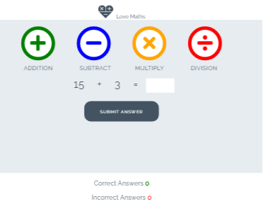
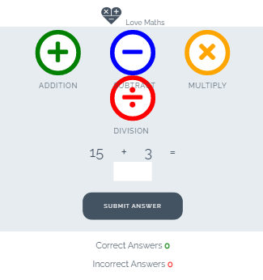
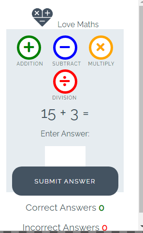

<h1>Love Maths</h1>

Love Maths is an intuitive website that aims to promote how javaScripts works in a real world context.  The site is aim to demonstrate to people advanced concepts of JavaScript and love of maths. Love maths is fully responsive JavaScript maths game that will allow users to add, subract, mutiply and divide numbers.

<h1>View of Love Maths on different Device<hi>

<h2>DESKTOP VIEW</h2> 

<h2>TABLET VIEW</h2>

<h2>SMART PHONE VIEW</h2>

<h1>Feactures</h1>
