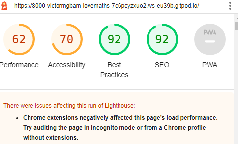

<h1>Love Maths</h1>

Love maths is an intuitive website that aims to promote how javaScripts works in a real world context.  The site is aim to demonstrate to people advanced concepts of JavaScript and love of maths. Love maths is fully responsive JavaScript maths game that will allow users to add, subract, mutiply and divide numbers.

<h1>View of Love Maths on different Device<hi>

<h2>DESKTOP VIEW</h2> 

<h2>TABLET VIEW</h2>

<h2>SMART PHONE VIEW</h2>

<h1>Features</h1>

Love maths website shows different features namely, the love maths logo and heading, the game area, 
the question area, and the score area.

  <h2>Existing features</h2>
    <ul>
      <li>The Love Maths Logo and Heading</li>
    </ul>
    <ol>
     <li>Featured at the top of the page, the love maths logo and heading is easy for the user to use. Upon viewing the page, the user will be able to navigate through the game.</li>
   </ol>

   

   <ul>
      <li>The Game Area</li>
    </ul>
    <ol>
     <li>This section of the area will allow the user to play the love maths game. The user will be able to see icons for addition, subtraction, multiplication and division.</li>
     <li>The user will be able to select the love maths game they want to play by clicking on the icon.</li>
   </ol>

   

   <ul>
      <li>The Question Section</li>
    </ul>
    <ol>
     <li>The question section is where the user will see the arithematic question to answer as part of the love maths game. The user will then answer the question the box provided</li>
     <li>The user will be able to submit answer with a submit button and a pop-up will show to the user if answered correctly.</li>
   </ol>

   

   <ul>
      <li>The Score Area</li>
    </ul>
    <ol>
     <li>This section will allow the user to how many correct and incorrect questions they answered.</li>
     <li>The additional features to implement in the future will be, to allow user to earn a badge for all questions answered correcting.</li>
   </ol>

   

  <h1>Testing</h1> 
     <h2>Manual Testing</h2> 
       <ul>
        <li>
          I tested love maths site on microsoft edge, chrome and firefox. It works in these browsers.
        </li>
        <li>I can confirm that the all the functions used in love maths site are working perfecting well includind the arithmethic returning the expected result. using "Am I Responsive tool.</li>
        <li>The love math site is very responsive on different device. This is achieved by using "Am I Responsive tool".This will enable users to play love maths on different device.</li>
      </ul>

  <h2>Validation Testing</h2>
    <h3>HTML</h3>  
       <ul><li>No errors were found when passing through official W3C validator<li></ul> 

  <h3>CSS</h3> 
   <ul><li>No errors were found when passing through official(Jigsaw) css validator</li></ul> 

   <h3>JavaScript</h3>
    <ul>
      <li>No errors were found when passing through Jshint validator.</li>
        The following Information metrics were returned:
      <li>There are 13 functions in the file.</li>
      <li>Function with the largest signature takes Two arguments, while the median is 0.</li>
      <li>Largest function has 11 statements in it, while the median is 3.</li>
      <li>The most complex function has cyclomatic complexity value of 5, while the median is 2.</li>
   </ul> 

   <h3>Accessibility</h3>
    <ul>
     <li>The font icon, text and color used in love maths site can be visually seen when user play love maths. This was achieved by running love maths through lighthouse. There are issues of my chrome as indicated in the image below.</li>
    </ul>

  

  <h1>Deployment</h1>
    <ul><li>Love maths was deployed using the followning steps:</li></ul>
     <ol>
      <li>Navigate to GitHub page, and click the settings.</li>
      <li>Scroll to the source menu and select main.</li> 
      <li>Once the main is selected, the page will load automatically and display the page link.</li> 

  <li>The link can be found here - https://victormgbam.github.io/love-maths/</li>  
  </ol>

  <h1>Credits</h1>

  <h3>Content</h3>
   <ul>
     <li>The code used for love maths project site was taken from code institute love maths project.</li>
     <li>The font icon was taken from love maths project.</li>
     <li>The instruction on validation was taken from code institute tutorials.</li>
   </ul>

   <h3>Media</h3>
   <ul>The image used in love maths was generated using "AM I RESPONSIVE and LIGHTHOUSE".</ul>

  