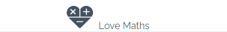
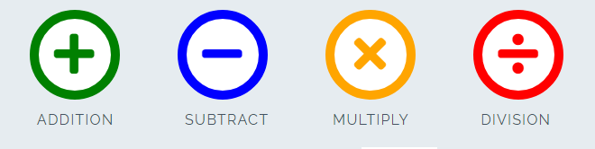
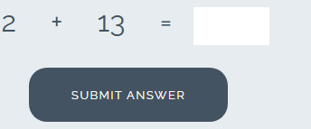
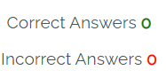

<h1>Love Maths</h1>

Love maths is an intuitive website that aims to promote how javaScripts works in a real world context.  The site is aim to demonstrate to people advanced concepts of JavaScript and love of maths. Love maths is fully responsive JavaScript maths game that will allow users to add, subract, mutiply and divide numbers.

<h1>View of Love Maths on different Device<hi>

<h2>DESKTOP VIEW</h2> 

<h2>TABLET VIEW</h2>

<h2>SMART PHONE VIEW</h2>

<h1>Features</h1>

Love maths website shows different features namely, the love maths logo and heading, the game area, 
the question area, and the score area.

  <h2>Existing features</h2>
    <ul>
      <li>The Love Maths Logo and Heading</li>
    </ul>
    <ol>
     <li>Featured at the top of the page, the love maths logo and heading is easy for the user to use. Upon viewing the page, the user will be able to navigate through the game.</li>
   </ol>

   

   <ul>
      <li>The Game Area</li>
    </ul>
    <ol>
     <li>This section of the area will allow the user to play the love maths game. The user will be able to see icons for addition, subtraction, multiplication and division.</li>
     <li>The user will be able to select the love maths game they want to play by clicking on the icon.</li>
   </ol>

   

   <ul>
      <li>The Question Section</li>
    </ul>
    <ol>
     <li>The question section is where the user will see the arithematic question to answer as part of the love maths game. The user will then answer the question the box provided</li>
     <li>The user will be able to submit answer with a submit button and a pop-up will show to the user if answered correctly.</li>
   </ol>

   

   <ul>
      <li>The Score Area</li>
    </ul>
    <ol>
     <li>This section will allow the user to how many correct and incorrect questions they answered.</li>
     <li>The additional features to implement in the future will be, to allow user to earn a badge for all questions answered correcting.</li>
   </ol>

   

  